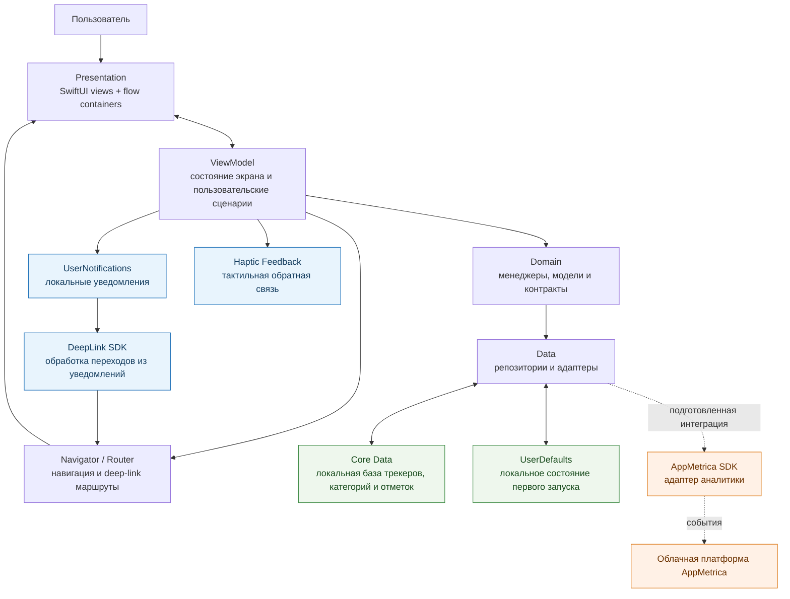

# Tracker

**Tracker** — iOS-приложение для планирования привычек и нерегулярных событий, ежедневной отметки прогресса и просмотра личной статистики. Интерфейс, жизненный цикл приложения, таб-бар и навигационные сценарии полностью построены на **SwiftUI**.

## Демонстрация

## Main Features

- Создание, редактирование, закрепление и удаление трекеров, объединённых в категории.
- Гибкое расписание привычек по дням недели, выбор эмодзи и цвета.
- Отметка выполнения, фильтрация по дате и статусу, поиск и постраничная загрузка списка.
- Экран статистики: количество выполнений, лучший период, идеальные дни и среднее число выполнений.
- Локальные уведомления по расписанию и переход к нужному разделу из уведомления.
- Локальное сохранение состояния первого запуска и данных пользователя.

## Архитектура системы

Проект использует **слоистую Clean Architecture** с **MVVM** в UI-модулях. Навигация вынесена в Navigator/Router, а создание и связывание зависимостей выполняется в composition root через **Swinject**.

| Слой | Ответственность |
| --- | --- |
| **Application / DI** | Инициализирует приложение, собирает зависимости и связывает модули между собой. |
| **Presentation** | SwiftUI-экраны и flow-контейнеры отображают состояние; ViewModel обрабатывают пользовательские действия и готовят данные для UI. |
| **Domain** | Содержит бизнес-модели, контракты репозиториев и менеджеры сценариев работы с трекерами и статистикой; не зависит от реализации хранения и UI. |
| **Data** | Реализует репозитории, преобразует доменные модели и изолирует доступ к локальному хранилищу и внешним SDK. |
| **System & integrations** | Инкапсулирует Apple API, локальные уведомления, deep links, haptic feedback и аналитический SDK. |

## Data Flow & API

### Как данные проходят через систему

Действие пользователя попадает из экрана во ViewModel, которая запускает сценарий доменного слоя. Domain обращается только к абстракциям репозиториев, а Data сохраняет или читает сущности через **Core Data**; после изменения хранилища ViewModel обновляют состояние экрана.

Расписание трекера преобразуется в локальные уведомления через **UserNotifications**. Нажатие на уведомление проходит через обработчик deep link и возвращает пользователя к соответствующему UI-сценарию. Внешняя интеграция представлена подготовленным адаптером **AppMetrica** для аналитики; продуктовые данные не отправляются в REST API и не зависят от удалённого бэкенда.
